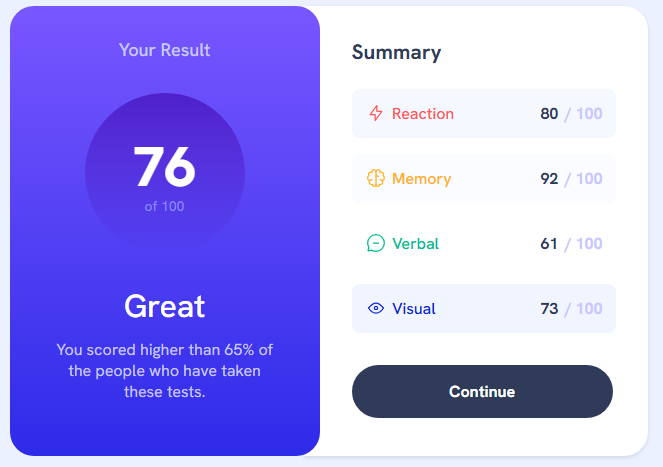
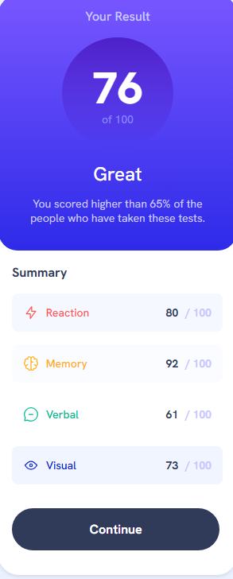

# Result Summary Component

Este projeto é uma solução para o desafio [Results summary component](https://www.frontendmentor.io/challenges/results-summary-component-CE_K6s0maV) do Frontend Mentor. O objetivo era criar um componente de resumo de resultados que fosse responsivo e visualmente atraente, seguindo um design fornecido.

## Visão Geral

### O Desafio

Os usuários devem ser capazes de:

- Visualizar o layout ideal para a interface, dependendo do tamanho da tela do dispositivo.
- Ver os estados de hover e focus para todos os elementos interativos na página.

### Screenshot

### Links

- [Site ao Vivo](https://cadanieldev.github.io/results-summay/)

## Meu Processo

### Construído com

- HTML5 semântico
- CSS3
- Flexbox
- CSS Grid
- Design responsivo
- Variáveis CSS
- Gradientes CSS

### O que Aprendi

Neste projeto, aprimorei minhas habilidades em:

- Uso de gradientes para criar designs modernos.
- Aplicação de estilos condicionais para diferentes tamanhos de tela.
- Organização de código CSS utilizando variáveis para facilitar a manutenção.

